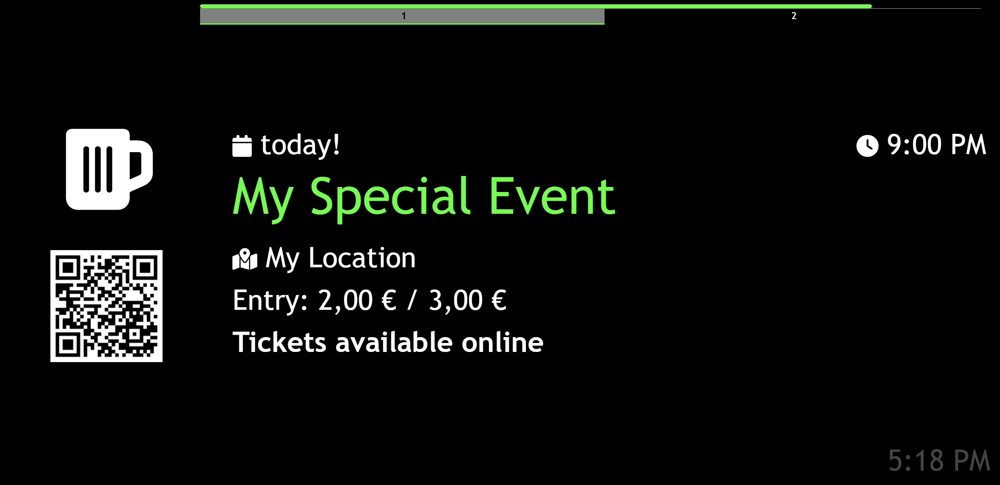
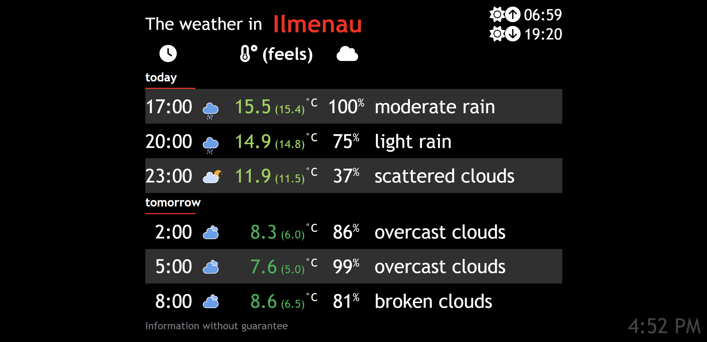
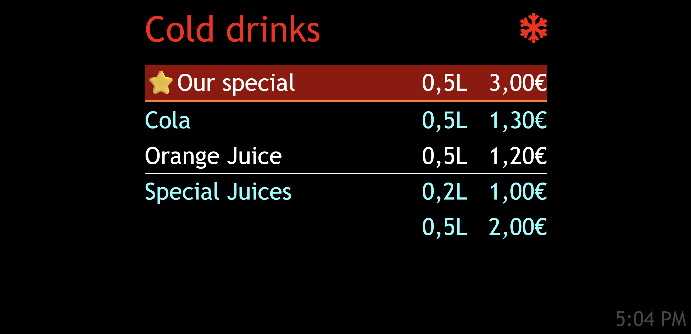
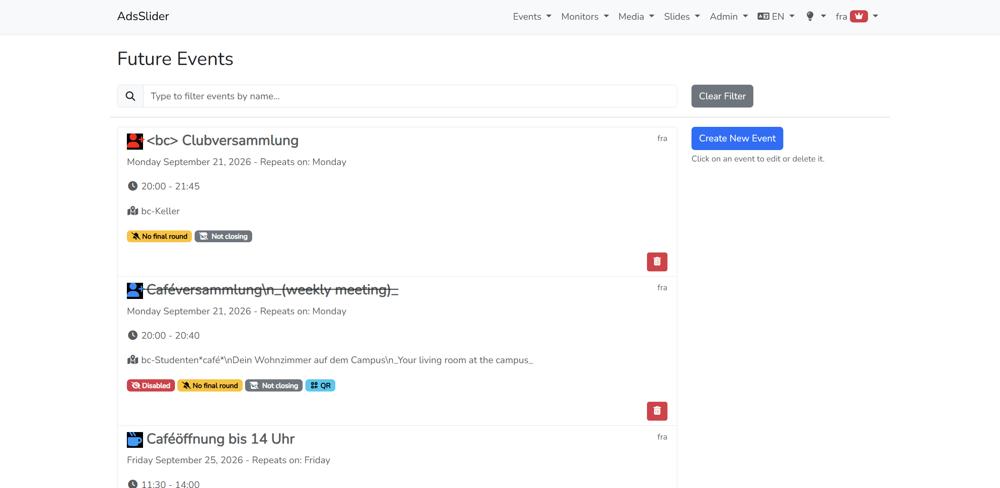

# AdsSlider


AdsSlider is a Laravel-based **digital signage** platform for displaying dynamic content in browser-based displays, kiosks, and Raspberry Pi setups. It is designed for venues such as bars, restaurants, cafés, and event spaces that need live information on screens without a heavy client installation.

The app can show events, menus, weather, emergency notices (Germany only), countdowns, pictures and videos, support live messages, and operational status information in a polished, easy-to-manage interface.

## Features

### Content and scheduling
- Event slides with time, location, links, colors, and icons
- Picture and video slides, supporting different aspect ratios with automatic source selection
- Menu and drinks listings
- Happy hour and countdown displays
- Closing and last-call signage automation

### Live operational updates
- Live alert messages pushed to all connected screens
- Weather forecast integration via OpenWeather (free key is required)
- Emergency and public safety notices such as Nina warnings (available in Germany only)

### Flexible deployment
- Browser-based display system for kiosk-friendly deployment
- Each monitor can have its own configuration
- Multi-language support for English, German, and Italian
- One deployment can support multiple isolated realms
- Works well even on low-power hardware such as Raspberry Pi devices

## Screenshots
### Digital signage




### Backend


## Tech stack

- PHP 8.4
- Laravel 13
- Livewire
- Vite + Bootstrap
- Reverb WebSockets
- MySQL / MariaDB
- OpenWeather API integration

## Requirements

Before running the project locally, make sure you have:

- PHP 8.4+
- Composer
- Node.js and npm
- MySQL or MariaDB

## Quick start

### 1) Clone the repository

```bash
git clone https://github.com/bedo2991/ads-slider.git
cd ads-slider
```

### 2) Configure environment variables

Copy the example environment file and update the required values:

```bash
cp .env.example .env
```

At minimum, configure:

- `APP_URL`
- `DB_DATABASE`
- `DB_USERNAME`
- `DB_PASSWORD`
- `FONT_AWESOME_KIT_URL`
- `OW_API_KEY`

If you plan to use Reverb/WebSockets (recommended for live refresh after data updates), install the Reverb configuration:

```bash
php artisan reverb:install
```

> The project includes a `.env.example` file with the required application-specific settings. For weather and branding, make sure to fill in the missing values before starting the app.

### 3) Install dependencies

```bash
composer install
npm install
```

### 4) Generate application key and storage link

```bash
php artisan key:generate
php artisan storage:link
```

### 5) Create the database and run migrations

```bash
php artisan migrate
```

### 6) Start the app

You can run the required services individually:

```bash
php artisan serve
php artisan queue:work
php artisan reverb:start --debug
npm run dev
```

Or, in VS Code, use the configured task to start the full stack together.

## Useful development commands

### Run the full local stack

```bash
composer run dev
```

This uses the project script to start the Laravel server, queue worker, logs, Reverb, and Vite front-end in parallel.

### Run tests

```bash
php artisan test
```

### Simulate scheduled tasks

```bash
php artisan schedule:run
```

### Format code

```bash
./vendor/bin/pint
```

### Localization

If you add or modify translatable strings:

```bash
php artisan translatable:export en,de,it
```

To inspect missing translations:

```bash
php artisan translatable:inspect-translations it
```

## Project notes

- Laravel Telescope is available in development under `/telescope`.
- Admin log access is available via `/logs`.
- A monitor can be opened at a specific slide by passing a query parameter `?s=...`:
  - `v` = videos
  - `p` = pictures
  - `w` = weather
  - `m` = menus
  - `e` = events
  - `k` = karaoke
  - `o` = order status

## Before publishing or committing

- Check dependency updates with `npm outdated` and `composer outdated`
- Run the test suite `php artisan test`
- Format code with `./vendor/bin/pint`
- Review configuration values before pushing any production-sensitive settings

## License

This project is licensed under the [European Union Public License 1.2 (EUPL 1.2)](https://spdx.org/licenses/EUPL-1.2.html).

## Contributing

Contributions are welcome. If you want to improve the project:

1. Fork the repository
2. Create a feature branch
3. Commit your changes with clear messages
4. Open a pull request with a concise description of the change

---

AdsSlider is intended to be a practical tool for managing digital signage content in real-world venues, with a focus on usability, automation, and low-friction deployment.